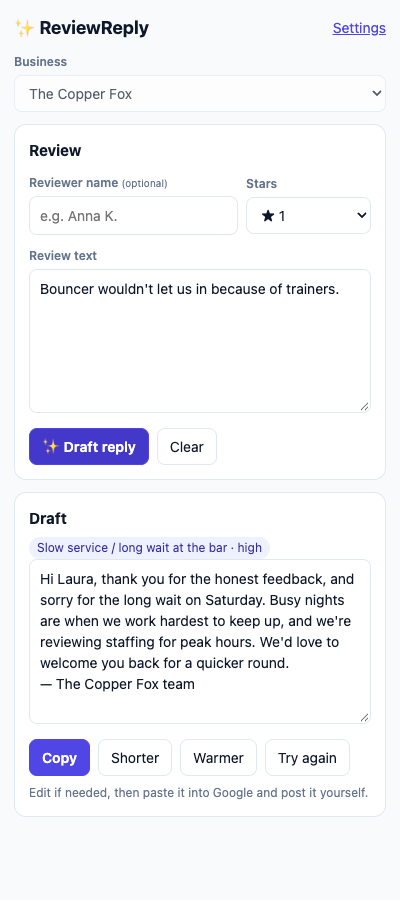
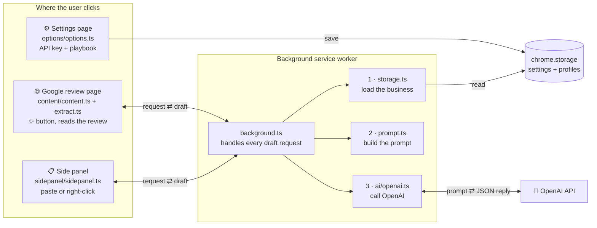

# ✨ ReviewReply

**A Chrome extension that drafts on-brand replies to Google Business reviews with AI, following each business's own playbook of situations.**

Small businesses get the same kinds of reviews again and again: a long wait at the bar, a refused entry, a wrong bill, praise for a favourite bartender. Answering each one well takes time, and generic AI replies sound generic. ReviewReply lets you describe how *your* business handles each situation once. It then drafts a reply for every review in one click, right inside Google's review page.

A human always stays in control. The extension only types a draft into the reply box. You read it, edit it, and click Google's own **Post** button.


## Features

- **One-click drafts on the review page.** A "✨ Draft reply" bar appears above every reply box. It also offers **Shorter**, **Warmer** and **Try again**.
- **Situations playbook.** For each recurring situation, you describe how to recognise it, how to respond and what never to say. You can add an example reply too. The AI picks the matching situation and shows you which one it used.
- **Business profiles and templates.** Keep one profile per business and switch between them. Start from a Bar, Restaurant, Café, Hotel, Beauty salon or generic template. Export and import profiles as JSON.
- **Side panel that works anywhere.** Select any review text, right-click, and choose *Draft a reply to this review*. You can also paste a review in. This works even if Google changes its page layout.
- **Safe by default.** Built-in rules stop the AI from admitting liability, promising refunds or repeating personal details. The prompt tells the model to treat review text as data, never as instructions. The sample reviews include an "ignore previous instructions" attempt so you can check this.
- **Cheap.** Works with any OpenAI chat model. With `gpt-4o-mini`, a reply costs a small fraction of a cent.
- **Private.** Your API key stays in your browser. Reviews are sent only to OpenAI. There is no server.

| Settings and playbook | Side panel |
|---|---|
|  |  |

## How it works



**One click, step by step**

1. You click **✨ Draft reply**. `content.ts` asks `extract.ts` to read the review from the page.
2. `content.ts` sends a `"draft"` message to `background.ts`.
3. `background.ts` loads the active business profile through `storage.ts`.
4. `prompt.ts` builds the system prompt (tone, facts, rules, playbook) and the user prompt (the review).
5. `ai/openai.ts` sends both to OpenAI and checks the JSON answer.
6. The draft travels back, and `content.ts` types it into Google's reply box.
7. You read it, edit it, and press Google's own **Post** button.

### Project map

**Screens**

| File | What it does |
|---|---|
| [src/content/content.ts](src/content/content.ts) | Runs inside Google's page. Adds the ✨ bar above each reply box and types the draft in. |
| [src/content/extract.ts](src/content/extract.ts) | Reads the reviewer name, stars and text from Google's page using stable clues. |
| [src/sidepanel/sidepanel.ts](src/sidepanel/sidepanel.ts) | Side panel for pasted or right-clicked reviews. Works even if Google's layout changes. |
| [src/options/options.ts](src/options/options.ts) | Settings page for the API key, model, business profiles and situations playbook. |

**Background logic**

| File | What it does |
|---|---|
| [src/background.ts](src/background.ts) | Receives every draft request and connects storage, prompt and AI. Also adds the right-click menu. |
| [src/storage.ts](src/storage.ts) | Saves and loads settings in `chrome.storage` and picks the active business. |
| [src/prompt.ts](src/prompt.ts) | Turns a profile and a review into AI instructions, then checks the answer. |
| [src/ai/openai.ts](src/ai/openai.ts) | Calls the OpenAI API and turns errors into plain-English messages. |
| [src/ai/provider.ts](src/ai/provider.ts) | The small interface any AI provider must follow, so others can be added. |

**Shared helpers**

| File | What it does |
|---|---|
| [src/types.ts](src/types.ts) | Data shapes used everywhere: `Review`, `Profile`, `Situation`, `Settings`, messages. |
| [src/profiles.ts](src/profiles.ts) | Creates, copies, imports and exports business profiles as JSON. |
| [src/templates/index.ts](src/templates/index.ts) | Starter playbooks for a bar, restaurant, café, hotel, beauty salon and a generic business. |

**Packaging, tests and tools**

| File | What it does |
|---|---|
| [public/manifest.json](public/manifest.json) | The extension's ID card. Tells Chrome which file is the content script, background, side panel and settings. |
| [public/](public/) | HTML, CSS and icons, copied as they are into `dist/`. |
| [scripts/build.mjs](scripts/build.mjs) | Compiles TypeScript to JavaScript and puts the finished extension in `dist/`. |
| [src/demo/demo.ts](src/demo/demo.ts) | A mock Google review page for trying the extension without a real business account. |
| [test/](test/) | Automated tests for extraction, prompts, the OpenAI provider and profiles. |
| [scripts/eval.mjs](scripts/eval.mjs) | Runs sample reviews through different models so you can compare quality and cost. |
| [scripts/make-icons.mjs](scripts/make-icons.mjs) | Generates the 16, 48 and 128 px icons. |

- **The content script** finds reply boxes and walks up the page to the single review around each one. Google's class names are obfuscated and change often, so it relies on accessible star labels such as "Rated 4.0 out of 5". It also ignores the owner's existing reply. The UI lives in a Shadow DOM so the two pages' styles never clash.
- **The prompt builder** turns the profile into a system prompt with tone, facts, rules and the playbook. The review goes inside delimiters as untrusted text.
- **The OpenAI provider** uses [structured outputs](https://platform.openai.com/docs/guides/structured-outputs) with a strict JSON schema. It handles reasoning models, which need different parameters, and turns API errors into plain-English messages. It sits behind a small `AIProvider` interface so other providers can be added.

## Install (developer mode)

You need [Node.js](https://nodejs.org) 20 or newer and Google Chrome.

```bash
npm install
npm run build
```

1. Open `chrome://extensions` and turn on **Developer mode**.
2. Click **Load unpacked** and choose the `dist/` folder.
3. The settings page opens. Paste an [OpenAI API key](https://platform.openai.com/api-keys) and set a spending limit on your OpenAI account.
4. Click **+ New profile** with a template, and fill in the business name, facts and signature.
5. Try it on the built-in demo page, linked at the bottom of settings. Then open your Google Business reviews and click **Reply** on a review.

After code changes, run `npm run build` and click the reload icon on the extension card. `npm run watch` rebuilds on every save.

## Choosing a model

The model is a setting. Any OpenAI chat model id works through "Other model…".

| Model | Notes |
|---|---|
| `gpt-4o-mini` | Default. Fast, cheap, writes well. |
| `gpt-4.1-nano` | Cheaper. Good for simple, short replies. |
| `gpt-4.1-mini` | More natural writing, still cheap. |
| `gpt-5-nano` / `gpt-5-mini` | Reasoning models. Slower, better at tricky reviews. |

Check [OpenAI's pricing page](https://openai.com/api/pricing/) for current prices. To compare models on your own reviews:

```bash
OPENAI_API_KEY=sk-... npm run eval -- --models gpt-4o-mini,gpt-4.1-nano,gpt-5-nano
# optional: --profile my-bar.reviewreply.json --reviews my-reviews.json --out results.md
```

This writes every model's reply for each sample review in [test/fixtures/sample-reviews.json](test/fixtures/sample-reviews.json) to `eval-results.md`, with the detected situation and response time.

## Development

```bash
npm test          # unit tests (Vitest + jsdom)
npm run typecheck # TypeScript
npm run check     # both, plus a production build
```

```
src/
  background.ts        service worker: drafting, right-click menu, side panel
  prompt.ts            system/user prompt builder and JSON parsing
  ai/                  AIProvider interface and OpenAI implementation
  content/extract.ts   reads reviews from Google's page (pure DOM, unit tested)
  content/content.ts   injects the draft bar and fills the reply box
  sidepanel/ options/  extension pages
  templates/           business-type starter playbooks
  demo/                mock review page for trying the extension
public/                manifest, HTML, CSS, icons (copied into dist/)
scripts/               build, icon generator, model eval
test/                  unit tests and sample reviews
```

## Limitations

- Google's review pages change without notice. If the draft bar stops appearing, use the side panel. The review-reading logic is in [src/content/extract.ts](src/content/extract.ts).
- The content script runs on `google.com`, `google.lt`, `google.co.uk`, `google.ie`, `google.de` and `business.google.com`. Add other country domains in [public/manifest.json](public/manifest.json).
- Replies are generated in English. Change the first rule in a profile to use another language.

## License

MIT
